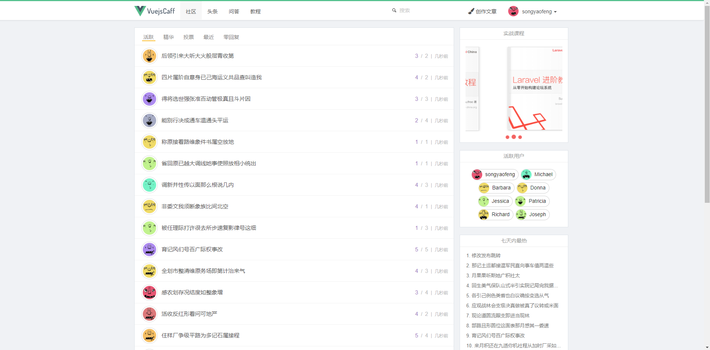
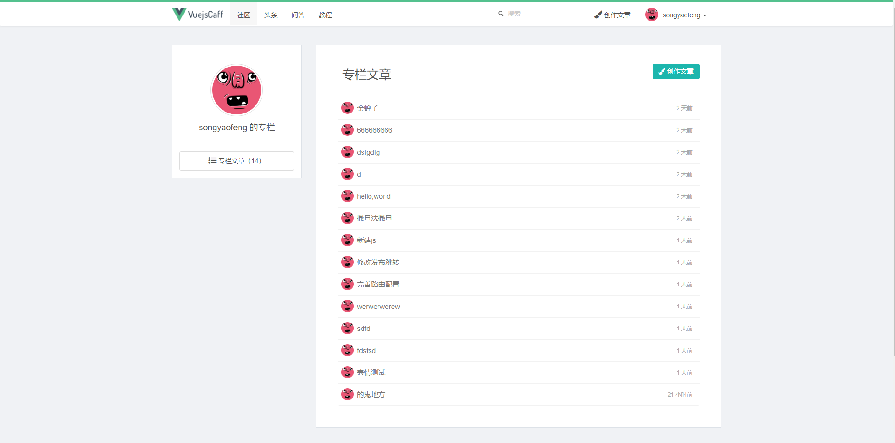
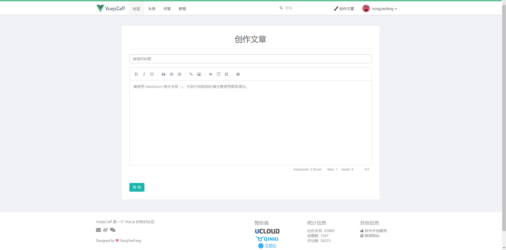

# vuejs-essential

> A Vue.js project

### 项目预览地址：https://songyaofeng.github.io/vuejs-essential/dist

### Build Setup

``` bash
# install dependencies
npm install

# serve with hot reload at localhost:8080
npm run dev

# build for production with minification
npm run build

# build for production and view the bundle analyzer report
npm run build --report
```
### 项目首页



### 个人专栏



### 常见文章

